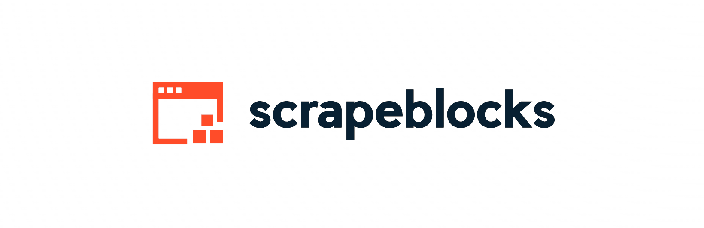



<div align="center">

[](https://github.com/tterb/atomic-design-ui/blob/master/LICENSEs)
[](https://www.npmjs.com/package/scrapeblocks)
[](https://lgtm.com/projects/g/alexferrari88/scrapeblocks/)
[](https://img.shields.io/github/last-commit/alexferrari88/scrapeblocks?style=flat-square)

</div>

# ScrapeBlocks

ScrapeBlocks is a layer on top of Playwright to make scraping automation easier.

You can set actions to be performed before starting scraping and you can also decide which scraping strategy to use.

Start with predefined actions and strategies in a matter of minutes. You can also write your own or use ones from the community.

## Who is this for? 🤔

- I just want to start scraping right now with little effort as possible
- I have a complicated scraping workflow that I want to simplify with still getting the same results
- I like to tinker with scraping and build my custom workflows

With ScrapeBlocks getting started with scraping is a matter of minutes.

You can use it with its batteries included or as extension to Playwright.

Whether you are a scraping-hero or just want to monitor the price for that product but you don't know much about scraping, ScrapeBlocks is here for you.

## Features 🚀

- **Pre-scraping actions**: perform actions before running a scraping strategy
  - Example use-case: you need to click something before your target becomes visible
- **Plug-n-play**: write your own scraping strategies or use those from the community
  - Example use-cases: scrape for text of certain elements, get all the images, etc.
- **Fully customizible (or not)**: you can use it batteries included or use your own Playwright instances
- **Easy to start with**: it's based on Playwright!

### Actions included ⚡

- [Click on any element](src/scraping-actions/Click.ts)
- [Add cookie](src/scraping-actions/AddCookies.ts)
- [Remove an element](src/scraping-actions/Remove.ts)
- [Type anywhere you can type something](src/scraping-actions/Type.ts)
- [Press keyboard buttons (e.g. Enter, CTRL+C, etc.)](src/scraping-actions/Press.ts)
- [Scroll to bottom of the page](src/scraping-actions/Scroll.ts)
- [Wait a certain amount of time](src/scraping-actions/Wait.ts)
- [Select](src/scraping-actions/Select.ts) any option from a `<select>` element
- _(to be continued...)_

### Strategies included 🧙🏼

- [Scrape text element](src/scraping-strategies/TextContentScraping.ts): retrieve the text within any element
- [Screenshot to map](src/scraping-strategies/ScreenshotToMap.ts): returns a screenshot of the page with a json with the coordinates and xpath/css selector for elements of your choice
- _(to be continued...)_

## Installation 🔧

Install ScrapeBlocks with npm

```bash
  npm install scrapeblocks
```

## Usage 🧑🏼‍💻

### Using built-in Playwright

#### Basic textContent strategy

```javascript
import { Scraper, ScrapingStragegies } from "scrapeblocks";

const URL = "https://webscraper.io/test-sites/e-commerce/allinone";
const selector = "h4.price";

const strategy = new ScrapingStragegies.TextContentScraping(selector);
const result = await new Scraper(URL, strategy).run();

console.log(result);
```

Output:

```bash
['$233.99', '$603.99', '$295.99']
```

#### With actions

```javascript
import { Scraper, ScrapingStragegies, Select } from "scrapeblocks";

const URL = "https://webscraper.io/test-sites/e-commerce/more/product/488";
const selectElement = "div.dropdown > select";
const optionToSelect = "Gold";
const selector = "div.caption > h4:nth-child(2)";

const strategy = new ScrapingStragegies.TextContentScraping(selector);
const selectAction = new Select({
	element: selectElement,
	value: optionToSelect,
});
const result = await new Scraper(URL, strategy, [selectAction]).run();

console.log(result);
```

Output:

```bash
Samsung Galaxy Gold
```

You can chain multiple actions by passing them in the order you want them to be executed as array.

Example:

```javascript
const actions = [scrollAction, clickAction, typeAction];
```

Starting from version 0.1.0, you can also just execute actions without providing any strategy.

The method will return instances of Playwright Browser, BrowserContext, Page.

Example:

<!-- prettier-ignore -->
```javascript
const { browser, context, page } =
        await new Scraper<PlaywrightBlocks>(
          URL, undefined, [clickAction,]
          ).run();
```

## TODO ✅

- Implement more strategies

- Implement more actions

- Increase test cases

- Write more extensive documentation

## Contributing 🤝🏼

Feel free to fork this repo and create a PR. I will review them and merge if ok.
The above todos can be a very good place to start.

## License 📝

[MIT](https://choosealicense.com/licenses/mit/)
